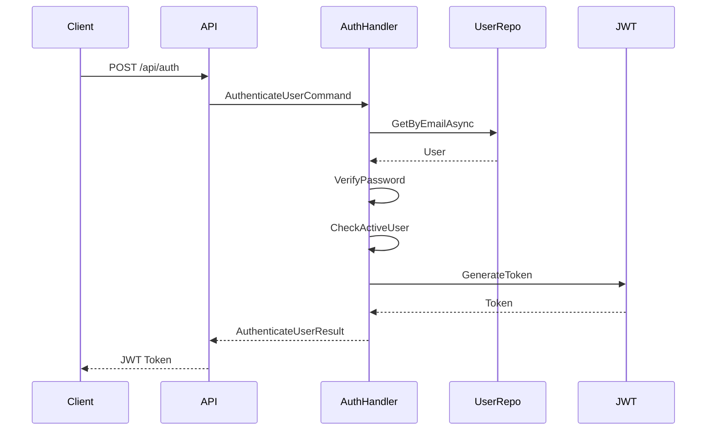
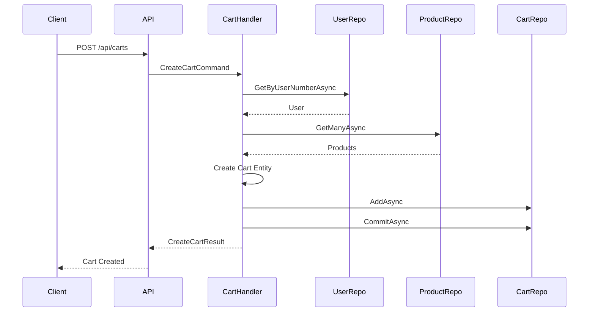
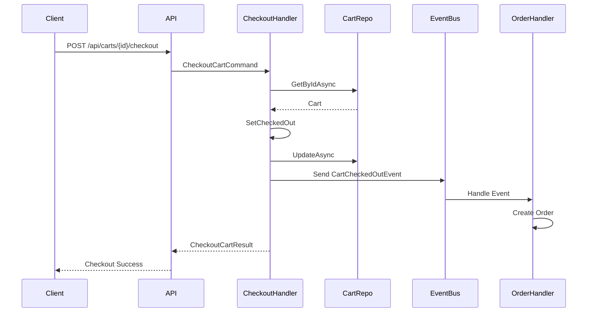
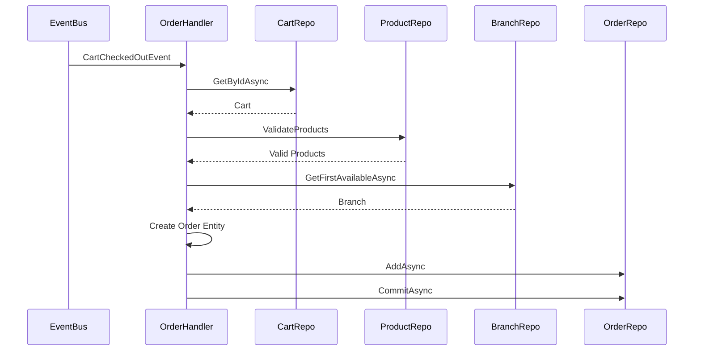

# 🍺 Ambev Developer Evaluation - Sistema de E-commerce

Sistema de e-commerce desenvolvido como parte da avaliação técnica da Ambev, implementando uma arquitetura limpa com Domain-Driven Design (DDD), CQRS e Event Sourcing.

## 📋 Índice

- [Visão Geral](#-visão-geral)
- [Arquitetura](#-arquitetura)
- [Tecnologias](#-tecnologias)
- [Pré-requisitos](#-pré-requisitos)
- [Configuração e Instalação](#-configuração-e-instalação)
- [Executando o Projeto](#-executando-o-projeto)
- [Testes](#-testes)
- [Documentação da API](#-documentação-da-api)
- [Fluxos Principais](#-fluxos-principais)
- [Estrutura do Projeto](#-estrutura-do-projeto)
- [Banco de Dados](#-banco-de-dados)
- [Autenticação](#-autenticação)
- [Deploy](#-deploy)
- [Contribuição](#-contribuição)

## 🎯 Visão Geral

Este projeto implementa um sistema de e-commerce completo com as seguintes funcionalidades:

- **Gestão de Usuários**: Criação, autenticação e gerenciamento de usuários
- **Catálogo de Produtos**: CRUD completo de produtos com categorias e avaliações
- **Carrinho de Compras**: Sistema de carrinho com MongoDB para alta performance
- **Processamento de Pedidos**: Criação automática de pedidos via eventos
- **Gestão de Filiais**: Administração de filiais para distribuição
- **Autenticação JWT**: Sistema seguro de autenticação e autorização

## 🏗️ Arquitetura

O projeto segue os princípios de **Clean Architecture** e **Domain-Driven Design (DDD)**:

```
┌─────────────────────────────────────────────────────────────┐
│                    Web API Layer                            │
│  ┌─────────────┐ ┌─────────────┐ ┌─────────────┐            │
│  │   Products  │ │    Users    │ │    Carts    │            │
│  │ Controller  │ │ Controller  │ │ Controller  │            │
│  └─────────────┘ └─────────────┘ └─────────────┘            │
└─────────────────────────────────────────────────────────────┘
┌─────────────────────────────────────────────────────────────┐
│                 Application Layer                           │
│  ┌─────────────┐ ┌─────────────┐ ┌─────────────┐            │
│  │   Commands  │ │   Queries   │ │   Handlers  │            │
│  │             │ │             │ │             │            │
│  └─────────────┘ └─────────────┘ └─────────────┘            │
└─────────────────────────────────────────────────────────────┘
┌─────────────────────────────────────────────────────────────┐
│                   Domain Layer                              │
│  ┌─────────────┐ ┌─────────────┐ ┌─────────────┐            │
│  │  Entities   │ │   Events    │ │  Services   │            │
│  │             │ │             │ │             │            │
│  └─────────────┘ └─────────────┘ └─────────────┘            │
└─────────────────────────────────────────────────────────────┘
┌─────────────────────────────────────────────────────────────┐
│                Infrastructure Layer                         │
│  ┌─────────────┐ ┌─────────────┐ ┌─────────────┐            │
│  │   ORM       │ │   NoSQL     │ │ Messaging   │            │
│  │ (PostgreSQL)│ │ (MongoDB)   │ │  (Rebus)    │            │
│  └─────────────┘ └─────────────┘ └─────────────┘            │
└─────────────────────────────────────────────────────────────┘
```

### Padrões Implementados

- **CQRS**: Separação entre Commands e Queries
- **Mediator Pattern**: Comunicação desacoplada entre camadas
- **Repository Pattern**: Abstração do acesso a dados
- **Unit of Work**: Gerenciamento de transações
- **Event Sourcing**: Processamento assíncrono de eventos
- **Specification Pattern**: Validações de negócio reutilizáveis

## 🛠️ Tecnologias

### Backend
- **.NET 8.0** - Framework principal
- **ASP.NET Core** - Web API
- **Entity Framework Core** - ORM para PostgreSQL
- **MongoDB** - Banco NoSQL para carrinhos
- **Rebus** - Message Bus para eventos
- **MediatR** - Mediator pattern
- **AutoMapper** - Mapeamento de objetos
- **FluentValidation** - Validação de dados
- **JWT** - Autenticação
- **BCrypt** - Hash de senhas
- **Serilog** - Logging
- **Swagger** - Documentação da API

### Banco de Dados
- **PostgreSQL 13** - Banco relacional principal
- **MongoDB 8.0** - Banco NoSQL para carrinhos
- **Redis 7.4** - Cache (opcional)

### Testes
- **xUnit** - Framework de testes
- **NSubstitute** - Mocking
- **FluentAssertions** - Asserções fluentes
- **Bogus** - Geração de dados de teste

## 📋 Pré-requisitos

### Desenvolvimento Local
- [.NET 8.0 SDK](https://dotnet.microsoft.com/download/dotnet/8.0)
- [Docker Desktop](https://www.docker.com/products/docker-desktop)
- [Git](https://git-scm.com/)

### IDE Recomendada
- [Visual Studio 2022](https://visualstudio.microsoft.com/vs/) (Windows)
- [Visual Studio Code](https://code.visualstudio.com/) + [C# Extension](https://marketplace.visualstudio.com/items?itemName=ms-dotnettools.csharp)
- [JetBrains Rider](https://www.jetbrains.com/rider/)

## ⚙️ Configuração e Instalação

### 1. Clone o Repositório

```bash
git clone <repository-url>
cd template/backend
```

### 2. Configuração do Ambiente

#### Opção A: Docker Compose (Recomendado)

```bash
# Iniciar os serviços de banco de dados
docker-compose up -d ambev.developerevaluation.database ambev.developerevaluation.nosql ambev.developerevaluation.cache
```

#### Opção B: Instalação Manual

**PostgreSQL:**
```bash
# Instalar PostgreSQL 13
# Criar banco de dados
createdb DeveloperStore
```

**MongoDB:**
```bash
# Instalar MongoDB 8.0
# MongoDB será iniciado automaticamente na porta 27017
```

### 3. Configuração da Aplicação

Edite o arquivo `src/Ambev.DeveloperEvaluation.WebApi/appsettings.json`:

```json
{
  "ConnectionStrings": {
    "PostgreSQLConnection": "Host=localhost;Port=5432;Database=DeveloperStore;Username=postgres;Password=123;TrustServerCertificate=True",
    "MongoDbConnection": "mongodb://localhost:27017"
  },
  "MongoDb": {
    "Database": "DeveloperStore"
  },
  "Jwt": {
    "SecretKey": "YourSuperSecretKeyForJwtTokenGenerationThatShouldBeAtLeast32BytesLong"
  }
}
```

### 4. Restaurar Dependências

```bash
dotnet restore
```

### 5. Executar Migrações

```bash
# Aplicar migrações do banco de dados
dotnet ef database update --project src/Ambev.DeveloperEvaluation.ORM --startup-project src/Ambev.DeveloperEvaluation.WebApi
```

## 🚀 Executando o Projeto

### Desenvolvimento Local

```bash
# Executar a aplicação
dotnet run --project src/Ambev.DeveloperEvaluation.WebApi

# Ou usando o Visual Studio
# Pressione F5 ou Ctrl+F5
```

A aplicação estará disponível em:
- **HTTP**: `http://localhost:5000`
- **HTTPS**: `https://localhost:5001`
- **Swagger UI**: `https://localhost:5001/swagger`

### Docker Compose

```bash
# Executar toda a stack
docker-compose up

# Executar em background
docker-compose up -d

# Parar os serviços
docker-compose down
```

### Verificação de Saúde

```bash
# Health check endpoint
curl https://localhost:5001/health
```

## 🧪 Testes

### Executar Todos os Testes

```bash
# Executar todos os testes
dotnet test

# Executar com detalhes
dotnet test --verbosity normal

# Executar testes específicos
dotnet test tests/Ambev.DeveloperEvaluation.Unit
```

### Cobertura de Código

```bash
# Windows
coverage-report.bat

# Linux/Mac
./coverage-report.sh
```

### Tipos de Testes

- **Unit Tests**: `tests/Ambev.DeveloperEvaluation.Unit/`
- **Integration Tests**: `tests/Ambev.DeveloperEvaluation.Integration/`
- **Functional Tests**: `tests/Ambev.DeveloperEvaluation.Functional/`

### Estatísticas dos Testes

- **Total de Testes**: 170+ testes
- **Cobertura**: >90% das funcionalidades principais
- **Handlers Testados**: 15+ handlers com cenários positivos e negativos

## 📚 Documentação da API

### Swagger UI

Acesse `https://localhost:5001/swagger` para a documentação interativa da API.

### Endpoints Principais

#### Autenticação
```
POST /api/auth
```

#### Produtos
```
GET    /api/products
GET    /api/products/{id}
POST   /api/products
PUT    /api/products/{id}
DELETE /api/products/{id}
GET    /api/products/categories
GET    /api/products/category/{category}
```

#### Usuários
```
GET    /api/users/{userNumber}
POST   /api/users
DELETE /api/users/{userNumber}
```

#### Carrinhos
```
GET    /api/carts
GET    /api/carts/{id}
POST   /api/carts
PUT    /api/carts/{id}
DELETE /api/carts/{id}
POST   /api/carts/{id}/checkout
```

#### Filiais
```
DELETE /api/branches/{id}
```

## 🔄 Fluxos Principais

### 1. Fluxo de Autenticação



### 2. Fluxo de Criação de Carrinho



### 3. Fluxo de Checkout



### 4. Fluxo de Criação de Pedido (Event-Driven)



## 📁 Estrutura do Projeto

```
template/backend/
├── src/
│   ├── Ambev.DeveloperEvaluation.WebApi/          # Camada de Apresentação
│   │   ├── Features/                              # Controllers e DTOs
│   │   ├── Mappings/                             # AutoMapper Profiles
│   │   ├── Middleware/                           # Middlewares customizados
│   │   └── Program.cs                           # Configuração da aplicação
│   │
│   ├── Ambev.DeveloperEvaluation.Application/     # Camada de Aplicação
│   │   ├── Auth/                                 # Autenticação
│   │   ├── Products/                             # Funcionalidades de Produtos
│   │   ├── Users/                                # Funcionalidades de Usuários
│   │   ├── Carts/                                # Funcionalidades de Carrinho
│   │   └── Branches/                             # Funcionalidades de Filiais
│   │
│   ├── Ambev.DeveloperEvaluation.Domain/          # Camada de Domínio
│   │   ├── Entities/                             # Entidades de domínio
│   │   ├── Events/                               # Eventos de domínio
│   │   ├── Enums/                                # Enumerações
│   │   ├── Repositories/                         # Interfaces de repositórios
│   │   ├── Services/                             # Serviços de domínio
│   │   ├── Specifications/                       # Especificações de negócio
│   │   ├── ValueObjects/                         # Objetos de valor
│   │   └── Validation/                           # Validadores de domínio
│   │
│   ├── Ambev.DeveloperEvaluation.ORM/             # Camada de Infraestrutura (ORM)
│   │   ├── DefaultContext.cs                     # Contexto do EF Core
│   │   ├── Mapping/                              # Configurações de mapeamento
│   │   ├── Migrations/                           # Migrações do banco
│   │   ├── Repositories/                         # Implementações de repositórios
│   │   └── UnitOfWork/                           # Implementação do UoW
│   │
│   ├── Ambev.DeveloperEvaluation.NoSQL/           # Camada de Infraestrutura (NoSQL)
│   │   └── Repositories/                         # Repositórios MongoDB
│   │
│   ├── Ambev.DeveloperEvaluation.Messaging/       # Camada de Mensageria
│   │   └── EventHandlers/                        # Handlers de eventos
│   │
│   ├── Ambev.DeveloperEvaluation.Common/           # Utilitários Comuns
│   │   ├── Security/                             # Autenticação e segurança
│   │   ├── Validation/                           # Validações comuns
│   │   ├── Logging/                              # Configuração de logs
│   │   └── HealthChecks/                         # Health checks
│   │
│   └── Ambev.DeveloperEvaluation.IoC/             # Injeção de Dependência
│       ├── ModuleInitializers/                   # Inicializadores de módulos
│       └── DependencyResolver.cs                 # Resolvedor de dependências
│
├── tests/
│   ├── Ambev.DeveloperEvaluation.Unit/           # Testes Unitários
│   ├── Ambev.DeveloperEvaluation.Integration/    # Testes de Integração
│   └── Ambev.DeveloperEvaluation.Functional/     # Testes Funcionais
│
├── docker-compose.yml                            # Configuração Docker
├── Dockerfile                                    # Imagem Docker
└── README.md                                     # Este arquivo
```

## 🗄️ Banco de Dados

### PostgreSQL (Banco Relacional)

**Tabelas Principais:**
- `Users` - Usuários do sistema
- `Products` - Catálogo de produtos
- `Branches` - Filiais da empresa
- `Orders` - Pedidos realizados
- `OrderItems` - Itens dos pedidos

**Configuração:**
```sql
-- Banco: DeveloperStore
-- Usuário: postgres
-- Senha: 123
-- Porta: 5432
```

### MongoDB (Banco NoSQL)

**Coleções:**
- `Carts` - Carrinhos de compra
- `CartItems` - Itens dos carrinhos

## 🔐 Autenticação

### JWT Configuration

- **Algoritmo**: HMAC SHA256
- **Expiração**: 8 horas
- **Claims**: UserId, Username, Role, Email
- **Secret Key**: Configurada em `appsettings.json`

### Fluxo de Autenticação

1. **Login**: `POST /api/auth` com email e senha
2. **Validação**: Verificação de credenciais e status do usuário
3. **Token**: Geração do JWT token
4. **Uso**: Incluir token no header `Authorization: Bearer {token}`

### Exemplo de Uso

```bash
# 1. Autenticar
curl -X POST "https://localhost:5001/api/auth" \
  -H "Content-Type: application/json" \
  -d '{"email": "admin@ambev.com", "password": "Admin123!"}'

# 2. Usar token
curl -X GET "https://localhost:5001/api/products" \
  -H "Authorization: Bearer SEU_TOKEN_AQUI"
```

### Usuários Padrão

Após executar as migrações, os seguintes usuários estarão disponíveis:

- **Admin**: `admin@ambev.com` / `Admin123!`
- **Customer**: `customer@ambev.com` / `Customer123!`

## Deploy

### Docker

```bash
# Build da imagem
docker build -t ambev-developer-evaluation .

# Executar container
docker run -p 8080:8080 -p 8081:8081 ambev-developer-evaluation
```

### Variáveis de Ambiente

```bash
# Produção
export ASPNETCORE_ENVIRONMENT=Production
export ConnectionStrings__PostgreSQLConnection="Host=prod-db;Port=5432;Database=DeveloperStore;Username=prod_user;Password=prod_pass"
export ConnectionStrings__MongoDbConnection="mongodb://prod-mongo:27017"
export Jwt__SecretKey="YourProductionSecretKeyHere"
```