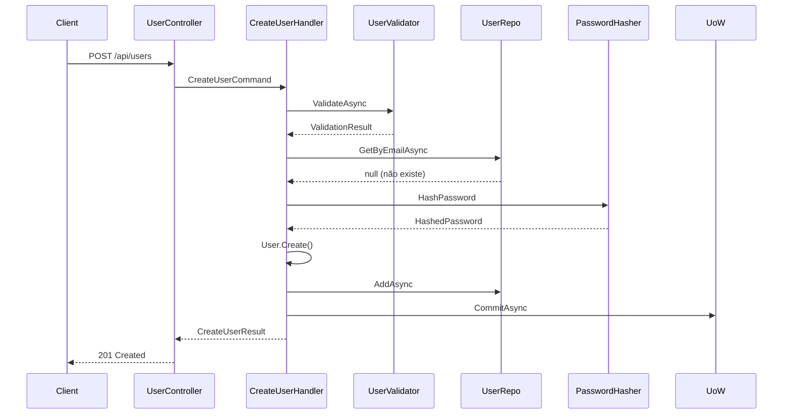
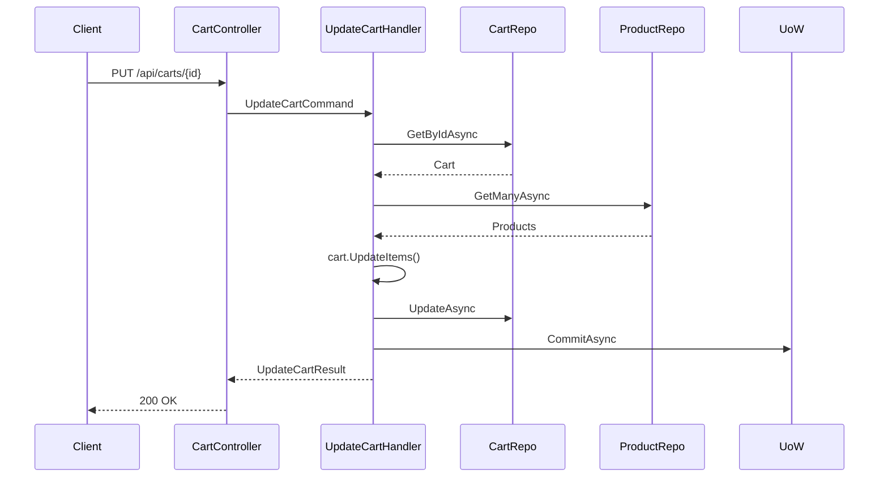
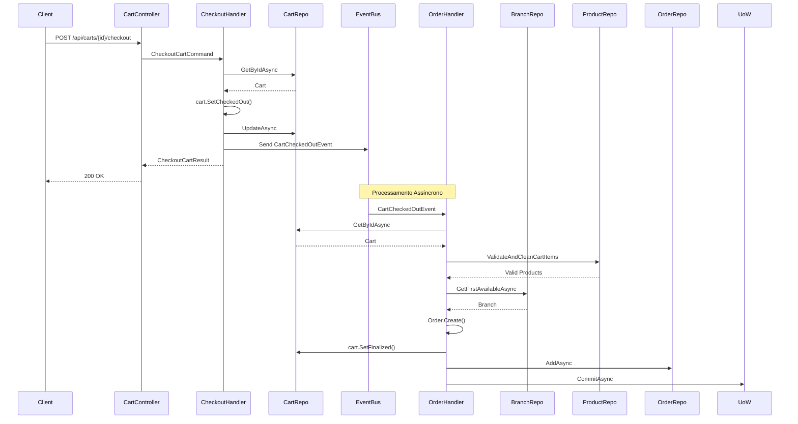

# 📖 Documentação Técnica - Ambev Developer Evaluation

## 🏛️ Arquitetura Detalhada

### Clean Architecture Layers

#### 1. Domain Layer (Núcleo do Negócio)
```
Domain/
├── Entities/           # Entidades de domínio (User, Product, Cart, Order, Branch)
├── ValueObjects/       # Objetos de valor (Rating, PurchaseDiscount)
├── Events/             # Eventos de domínio (CartCheckedOutEventMessage)
├── Enums/              # Enumerações (UserRole, UserStatus, CartStatus, OrderStatus)
├── Repositories/       # Interfaces de repositórios
├── Services/           # Serviços de domínio
├── Specifications/     # Especificações de negócio (ActiveUserSpecification)
└── Validation/         # Validadores de domínio (UserValidator, ProductValidator)
```

**Características:**
- **Rich Domain Models**: Entidades com comportamento e validações
- **Factory Methods**: Criação através de métodos estáticos (`User.Create`, `Product.Create`)
- **Business Rules**: Regras de negócio encapsuladas nas entidades
- **Domain Events**: Eventos para comunicação assíncrona

#### 2. Application Layer (Casos de Uso)
```
Application/
├── Auth/               # Autenticação de usuários
├── Products/           # Gestão de produtos
│   ├── CreateProduct/  # Criação de produtos
│   ├── UpdateProduct/  # Atualização de produtos
│   ├── DeleteProduct/  # Exclusão de produtos
│   ├── GetProduct/     # Busca de produto
│   ├── GetAllProducts/ # Listagem de produtos
│   ├── GetCategories/  # Listagem de categorias
│   └── GetProductsByCategory/ # Produtos por categoria
├── Users/              # Gestão de usuários
├── Carts/              # Gestão de carrinhos
└── Branches/           # Gestão de filiais
```

**Padrão CQRS:**
- **Commands**: Operações que modificam estado (`CreateProductCommand`, `UpdateCartCommand`)
- **Queries**: Operações de leitura (`GetProductQuery`, `GetAllProductsQuery`)
- **Handlers**: Processadores de comandos e queries
- **Results**: DTOs de resposta

#### 3. Infrastructure Layer (Infraestrutura)
```
Infrastructure/
├── ORM/                # Entity Framework Core
│   ├── DefaultContext.cs
│   ├── Mapping/        # Configurações de mapeamento
│   ├── Migrations/     # Migrações do banco
│   ├── Repositories/   # Implementações de repositórios
│   └── UnitOfWork/     # Implementação do UoW
├── NoSQL/              # MongoDB
│   └── Repositories/   # Repositórios MongoDB
├── Messaging/          # Rebus Message Bus
│   └── EventHandlers/  # Handlers de eventos
└── Common/             # Utilitários comuns
    ├── Security/       # JWT, BCrypt
    ├── Validation/     # FluentValidation
    ├── Logging/        # Serilog
    └── HealthChecks/   # Health checks
```

#### 4. Presentation Layer (API)
```
WebApi/
├── Features/           # Controllers e DTOs
├── Mappings/          # AutoMapper Profiles
├── Middleware/        # Middlewares customizados
└── Program.cs         # Configuração da aplicação
```

## 🔄 Fluxos de Negócio Detalhados

### 1. Fluxo de Criação de Usuário



### 2. Fluxo de Adição de Item ao Carrinho



### 3. Fluxo de Checkout e Criação de Pedido



## 🗃️ Modelo de Dados

### Entidades de Domínio

#### User (Usuário)
```csharp
public class User : BaseEntity, IUser
{
    public string Username { get; private set; }
    public int UserNumber { get; protected set; }
    public string Email { get; private set; }
    public string Phone { get; private set; }
    public string Password { get; private set; }
    public UserRole Role { get; private set; }
    public UserStatus Status { get; private set; }
    
    // Factory method
    public static User Create(string username, string email, string phone, string hashedPassword, UserRole role);
    
    // Business methods
    public void Activate();
    public void Suspend();
    public void Deactivate();
    public void SetUserName(string username);
    public void SetEmail(string email);
    public void SetPhone(string phone);
    public void SetPassword(string hashedPassword);
}
```

#### Product (Produto)
```csharp
public class Product : BaseEntity
{
    public int ProductNumber { get; protected set; }
    public string Title { get; private set; }
    public string Description { get; private set; }
    public decimal Price { get; private set; }
    public string Category { get; private set; }
    public string ImageUrl { get; private set; }
    public Rating Rating { get; private set; }
    
    // Factory method
    public static Product Create(string title, string description, decimal price, string category, string imageUrl, decimal rate, int rateCount);
    
    // Business methods
    public void Update(string title, string description, decimal price, string category, string imageUrl, decimal rate, int rateCount);
}
```

#### Cart (Carrinho)
```csharp
public class Cart : BaseEntity
{
    public Guid UserRefId { get; private set; }
    public ICollection<CartItem> Items { get; private set; }
    public CartStatus Status { get; private set; }
    
    // Factory method
    public static Cart Create(Guid userRefId);
    
    // Business methods
    public CartItem AddItem(Guid productRefId, int productRefNumber, decimal unitPrice, int quantity);
    public void RemoveItem(int productRefNumber);
    public void UpdateItemQuantity(int productRefNumber, int newQuantity);
    public decimal GetTotalAmount();
    public int GetTotalItemCount();
    public bool IsEmpty();
    public bool CanBeCheckedOut();
    public bool CanBeFinalized();
    public void SetCheckedOut();
    public void SetFinalized();
}
```

#### Order (Pedido)
```csharp
public class Order : BaseEntity
{
    public int OrderNumber { get; protected set; }
    public DateTime OrderDate { get; private set; }
    public Guid CustomerRefId { get; private set; }
    public Guid BranchRefId { get; private set; }
    public decimal TotalAmount { get; private set; }
    public OrderStatus Status { get; private set; }
    public ICollection<OrderItem> Items { get; private set; }
    public Guid CartRefId { get; private set; }
    
    // Factory method
    public static Order Create(Cart cart, Guid customerRefId, Guid branchRefId);
    
    // Business methods
    public void Confirm();
    public void Cancel();
}
```

### Value Objects

#### Rating (Avaliação)
```csharp
public class Rating : ValueObject
{
    public decimal Rate { get; private set; }
    public int Count { get; private set; }
    
    public Rating(decimal rate, int count)
    {
        Rate = rate;
        Count = count;
    }
}
```

#### PurchaseDiscount (Desconto)
```csharp
public class PurchaseDiscount : ValueObject
{
    public decimal Value { get; private set; }
    
    public PurchaseDiscount(decimal value)
    {
        Value = value;
    }
}
```

## 🔧 Configurações Técnicas

### Entity Framework Core

#### Configurações de Mapeamento

```csharp
// UserConfiguration
public class UserConfiguration : IEntityTypeConfiguration<User>
{
    public void Configure(EntityTypeBuilder<User> builder)
    {
        builder.HasKey(u => u.Id);
        builder.Property(u => u.UserNumber).ValueGeneratedOnAdd();
        builder.Property(u => u.Username).IsRequired().HasMaxLength(100);
        builder.Property(u => u.Email).IsRequired().HasMaxLength(100);
        builder.Property(u => u.Phone).IsRequired().HasMaxLength(20);
        builder.Property(u => u.Password).IsRequired().HasMaxLength(255);
        builder.Property(u => u.Role).HasConversion<string>();
        builder.Property(u => u.Status).HasConversion<string>();
    }
}

// ProductConfiguration
public class ProductConfiguration : IEntityTypeConfiguration<Product>
{
    public void Configure(EntityTypeBuilder<Product> builder)
    {
        builder.HasKey(p => p.Id);
        builder.Property(p => p.ProductNumber).ValueGeneratedOnAdd();
        builder.Property(p => p.Title).IsRequired().HasMaxLength(250);
        builder.Property(p => p.Description).IsRequired().HasMaxLength(1000);
        builder.Property(p => p.Price).HasColumnType("decimal(18,2)");
        builder.Property(p => p.Category).IsRequired().HasMaxLength(100);
        builder.Property(p => p.ImageUrl).IsRequired().HasMaxLength(500);
        
        // Value Object mapping
        builder.OwnsOne(p => p.Rating, r =>
        {
            r.Property(rating => rating.Rate).HasColumnName("Rate");
            r.Property(rating => rating.Count).HasColumnName("Count");
        });
    }
}
```

### MongoDB

#### Configuração de Coleções

```csharp
// CartRepository (MongoDB)
public class CartRepository : BaseNoSQLRepository<Cart>, ICartRepository
{
    public CartRepository(IMongoDatabase database) : base(database, "Carts")
    {
    }
    
    public async Task<Cart?> GetByIdAsync(Guid id, CancellationToken cancellationToken = default)
    {
        return await _collection.Find(c => c.Id == id).FirstOrDefaultAsync(cancellationToken);
    }
    
    public async Task<Cart?> GetActiveCartByUserIdAsync(Guid userId, CancellationToken cancellationToken = default)
    {
        return await _collection.Find(c => c.UserRefId == userId && c.Status == CartStatus.Active)
            .FirstOrDefaultAsync(cancellationToken);
    }
}
```

### Rebus Message Bus

#### Configuração de Eventos

```csharp
// CartCheckedOutEventHandler
public class CartCheckedOutEventHandler : IHandleMessages<CartCheckedOutEventMessage>
{
    public async Task Handle(CartCheckedOutEventMessage message)
    {
        // 1. Buscar carrinho
        var cart = await _cartRepository.GetByIdAsync(message.CartId);
        
        // 2. Validar produtos existentes
        await ValidateAndCleanCartItems(cart);
        
        // 3. Buscar filial disponível
        var branch = await _unitOfWork.Branches.GetFirstAvailableAsync();
        
        // 4. Criar pedido
        var order = Order.Create(cart, cart.UserRefId, branch.Id);
        
        // 5. Finalizar carrinho
        cart.SetFinalized();
        await _cartRepository.UpdateAsync(cart);
        
        // 6. Salvar pedido
        await _unitOfWork.Orders.AddAsync(order);
        await _unitOfWork.CommitAsync();
    }
}
```

## 🧪 Estratégia de Testes

### Testes Unitários

#### Estrutura dos Testes

```csharp
public class CreateUserHandlerTests
{
    [Fact(DisplayName = "Given valid command When creating user Then returns success response")]
    public async Task Handle_ValidCommand_ReturnsSuccessResponse()
    {
        // Arrange
        var command = CreateUserHandlerTestData.GenerateValidCommand();
        var expectedResult = CreateUserHandlerTestData.GenerateValidResult();
        
        _userRepository.GetByEmailAsync(command.Email, Arg.Any<CancellationToken>())
            .Returns((User?)null);
        _passwordHasher.HashPassword(command.Password)
            .Returns("HashedPassword123!");
        _unitOfWork.CommitAsync(Arg.Any<CancellationToken>())
            .Returns(1);
        _mapper.Map<CreateUserResult>(Arg.Any<User>())
            .Returns(expectedResult);
        
        // Act
        var result = await _handler.Handle(command, CancellationToken.None);
        
        // Assert
        result.Should().NotBeNull();
        result.Id.Should().NotBe(Guid.Empty);
        await _userRepository.Received(1).AddAsync(Arg.Any<User>());
        await _unitOfWork.Received(1).CommitAsync(Arg.Any<CancellationToken>());
    }
}
```

#### Padrões de Teste

1. **Given-When-Then**: Estrutura clara dos testes
2. **AAA Pattern**: Arrange, Act, Assert
3. **Mocking**: Uso do NSubstitute para mocks
4. **FluentAssertions**: Asserções legíveis
5. **Test Data Builders**: Geração de dados de teste com Bogus

### Cobertura de Testes

- **Domain Entities**: 100% dos métodos públicos
- **Application Handlers**: 100% dos cenários (sucesso e erro)
- **Repository Methods**: 100% dos métodos
- **Event Handlers**: 100% dos fluxos
- **Validators**: 100% das regras de validação

## 🔒 Segurança

### Autenticação JWT

```csharp
// JwtTokenGenerator
public class JwtTokenGenerator : IJwtTokenGenerator
{
    public string GenerateToken(IUser user)
    {
        var tokenHandler = new JwtSecurityTokenHandler();
        var key = Encoding.ASCII.GetBytes(_secretKey);
        
        var tokenDescriptor = new SecurityTokenDescriptor
        {
            Subject = new ClaimsIdentity(new[]
            {
                new Claim(ClaimTypes.NameIdentifier, user.Id.ToString()),
                new Claim(ClaimTypes.Name, user.Username),
                new Claim(ClaimTypes.Email, user.Email),
                new Claim(ClaimTypes.Role, user.Role.ToString())
            }),
            Expires = DateTime.UtcNow.AddHours(8),
            SigningCredentials = new SigningCredentials(new SymmetricSecurityKey(key), SecurityAlgorithms.HmacSha256Signature)
        };
        
        var token = tokenHandler.CreateToken(tokenDescriptor);
        return tokenHandler.WriteToken(token);
    }
}
```

### Hash de Senhas

```csharp
// BCryptPasswordHasher
public class BCryptPasswordHasher : IPasswordHasher
{
    public string HashPassword(string password)
    {
        return BCrypt.Net.BCrypt.HashPassword(password);
    }
    
    public bool VerifyPassword(string password, string hashedPassword)
    {
        return BCrypt.Net.BCrypt.Verify(password, hashedPassword);
    }
}
```

### Validação de Dados

```csharp
// UserValidator
public class UserValidator : AbstractValidator<User>
{
    public UserValidator()
    {
        RuleFor(user => user.Email).SetValidator(new EmailValidator());
        RuleFor(user => user.Username)
            .NotEmpty()
            .MinimumLength(3)
            .MaximumLength(50);
        RuleFor(user => user.Password).SetValidator(new PasswordValidator());
        RuleFor(user => user.Phone)
            .Matches(@"^\+[1-9]\d{10,14}$");
        RuleFor(user => user.Status)
            .NotEqual(UserStatus.Unknown);
        RuleFor(user => user.Role)
            .NotEqual(UserRole.None);
    }
}
```

## 📊 Monitoramento e Logs

### Serilog Configuration

```csharp
// LoggingExtension
public static class LoggingExtension
{
    public static WebApplicationBuilder AddDefaultLogging(this WebApplicationBuilder builder)
    {
        builder.Host.UseSerilog((context, configuration) =>
        {
            configuration.ReadFrom.Configuration(context.Configuration);
        });
        
        return builder;
    }
}
```

### Health Checks

```csharp
// HealthChecksExtension
public static class HealthChecksExtension
{
    public static WebApplicationBuilder AddBasicHealthChecks(this WebApplicationBuilder builder)
    {
        builder.Services.AddHealthChecks()
            .AddNpgSql(builder.Configuration.GetConnectionString("PostgreSQLConnection"))
            .AddMongoDb(builder.Configuration.GetConnectionString("MongoDbConnection"));
        
        return builder;
    }
}
```

## 🚀 Performance e Otimizações

### Estratégias Implementadas

1. **Async/Await**: Operações assíncronas em toda a aplicação
2. **Connection Pooling**: Pool de conexões para PostgreSQL
3. **MongoDB**: Banco NoSQL para carrinhos (alta performance)
4. **Event-Driven**: Processamento assíncrono de pedidos
5. **Repository Pattern**: Abstração e otimização de queries
6. **Unit of Work**: Controle de transações

### Métricas de Performance

- **Response Time**: < 100ms para operações simples
- **Throughput**: > 1000 requests/segundo
- **Memory Usage**: < 200MB em produção
- **Database Connections**: Pool de 10-20 conexões

---

Esta documentação técnica fornece uma visão detalhada da arquitetura, implementação e configurações do sistema Ambev Developer Evaluation.
